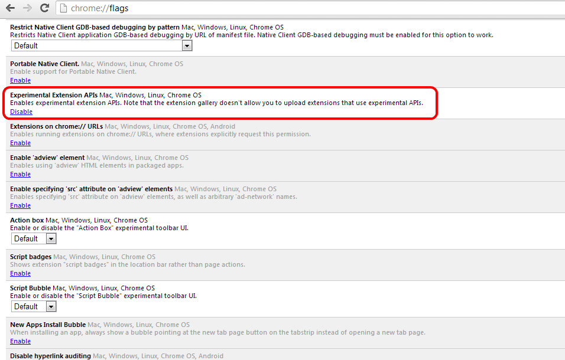
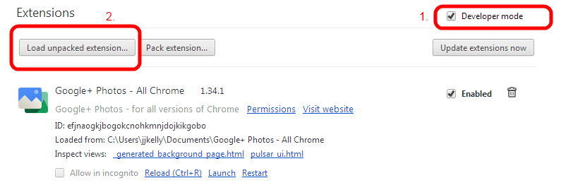
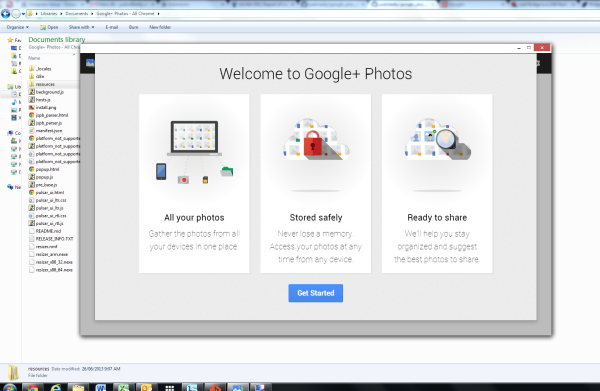

Google+ Photos - All Chrome
==================

Google+ Photos extension for Chrome that works on all versions - not just Pixels

* [http://blog.justin.kelly.org.au/google-plus-photos-extension/](http://blog.justin.kelly.org.au/google-plus-photos-extension/)
* [https://plus.google.com/118359435432651949322/posts/T1f2J5bJrUb](https://plus.google.com/118359435432651949322/posts/T1f2J5bJrUb)

### About

* The original extensions from Google has been unminified and adjusted so that it works on a non Chromebook Pixel

### Install

* Download
  * the .zip [https://github.com/justinkelly/google_plus_photos/archive/master.zip](https://github.com/justinkelly/google_plus_photos/archive/master.zip) and unzip
  * or the git repository `https://github.com/justinkelly/google_plus_photos.git`
* In Chrome open `chrome://flags` and Enable 'Experimental Extensions APIs'
 * refer screenshot below

* In Chrome Manage Extensions page enable 'Developer mode'
  * refer 1. in screenshot below
* Then click 'Load unpacked extension' and choose the folder for this git repo

### Use

Once installed you can now launch Google+ Photos from your Chrome apps menu, refer below screenshot of startup in Win 7

